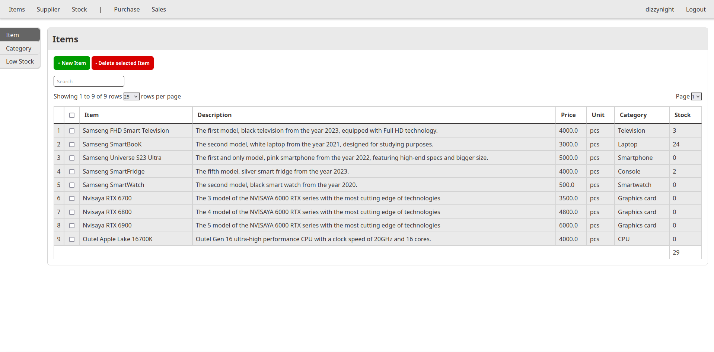

Inven3
======

Inven3 is a small scale Inventory Management System that runs in a Spring webserver using a PostgreSQL database for backend. 

A proof of concept hastily made for a Java college assignment.



Prerequisite
------------

- [Java 21](https://www.oracle.com/java/technologies/downloads/) or later
- [Docker Engine](https://www.docker.com/)

Deployment
----------

### IntelliJ (Easiest)

IntelliJ can load the project and handle all the dependencies for you. 
The run config `Inven3Application` should use the right JVM, run the docker container, and deploy Spring. 

The website should be live on `http://localhost:8080` on default with test data populated.

### Maven

Maven should install the dependencies and run server. *hypothetically*

```sh
./mvnw spring-boot:run
```

## Configuration

`.env` holds all the environment variables for the database and Spring. 

It is recommended to change the `POSTGRES_USER` and `POSTGRES_PASSWORD` values.

Usage
-----

The website should be hosted on `http://localhost:8080` on your local machine.
With the default test data initialized, the default admin login is 

Username: `admin`

Password: `admin` 

Troubleshoot
------------

#### Port 8080 is already occupied

Disable the service occupying the port 8080 or change the webserver port in `.env` of `SPRING_PORT` to an open port.

License
-------

Licensed under the [Apache 2.0](https://choosealicense.com/licenses/apache-2.0/) license. See [LICENSE](https://github.com/Poleric/Inven3/blob/master/LICENSE) 

